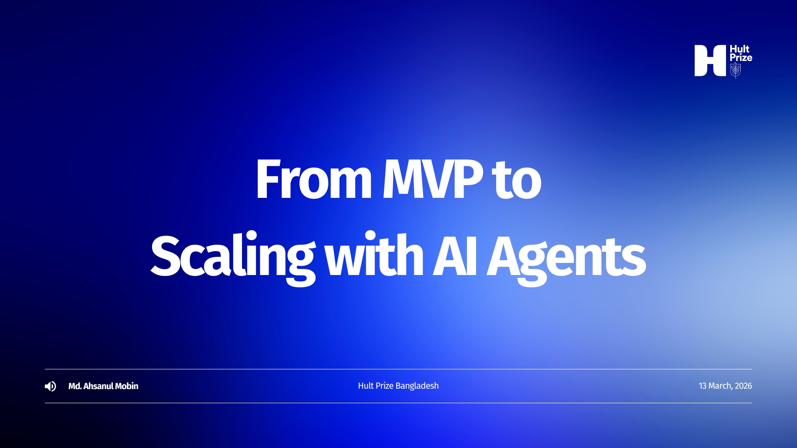

# Scale Shift: Hult Prize Execution Bootcamp | Workshop 2
**From Problem to MVP (Execution Basics)**

> *"If you are not embarrassed by the first version of your product, you are not shipping fast enough."* — Hussain Elius, Co-founder, Pathao

---

  

This session is part of the **Scale Shift: Hult Prize Execution Bootcamp**, designed to support Campus Round winning teams across Bangladesh as they prepare for the national stage. The workshop focuses on helping teams move from problem identification to building practical Minimum Viable Products (MVPs), with a strong emphasis on validation, rapid prototyping, and execution.

## Session Details
- **Resource Person:** Md. Ahsanul Mobin
- **Role:** CPTO, Somadhan | Former Product Manager, WeGro
- **Date:** 13 March 2026 (Friday)
- **Time:** 3:00 PM (GMT+6)
- **Platform:** Google Meet

Participants will gain practical insights on translating ideas into testable solutions and building MVPs with speed and clarity.

---

## 📄 Slides

[View the slides online →](https://www.slideshare.net/slideshow/from-mvp-to-scaling-with-ai-agents_hult-prize-workshop/286505206)

  

---

## 🗺️ Workshop Chapters

| # | Chapter | What You'll Learn |
|---|---------|-------------------|
| 1 | [Plan & Architect](./01-plan-and-architect/) | FigJam, Notion, process mapping |
| 2 | [Choose Your Stack](./02-choose-your-stack/) | AI prototyping tools, VS Code + Copilot |
| 3 | [Connect Your Data Layer](./03-connect-data-layer/) | GitHub, Supabase, Vercel, Netlify |
| 4 | [Add Memory with MCP](./04-add-memory-mcp/) | Model Context Protocol, Claude Skills |
| 5 | [Test, Debug & Improve](./05-test-debug-improve/) | Analytics, The Mom Test, user feedback |
| 6 | [Scale & Automate](./06-scale-and-automate/) | Telegram bots, automation, AI agents |

---

## 💬 Discussion & Q&A
Have questions from the session? **[Open a Discussion →](https://github.com/MobinMithun/hult-prize-mvp-to-ai-agents/discussions)**
Or drop an issue and I'll answer it there.

---

## 👤 About the Speaker
- 🔗 [LinkedIn](https://linkedin.com/in/mobinmithun)
- 🌐 [Website](https://mobin.somadhan.com)
- 📧 mobinmithun@gmail.com
- ☕ [Support the Work](https://www.supportkori.com/mobinmithun)

  

